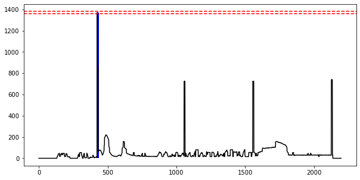
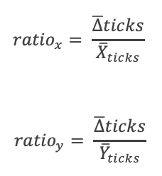
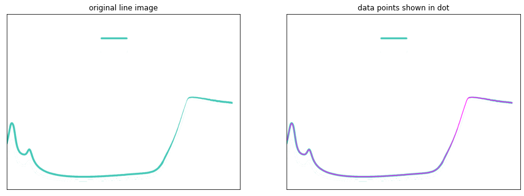
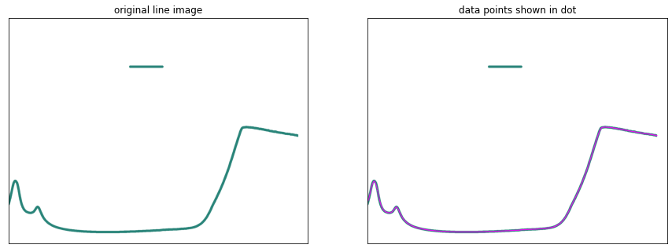
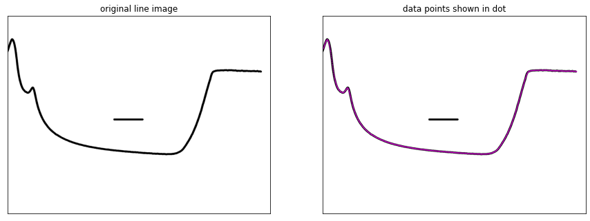
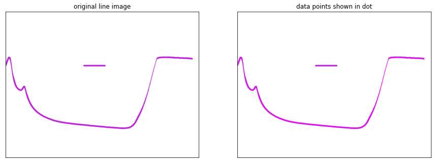
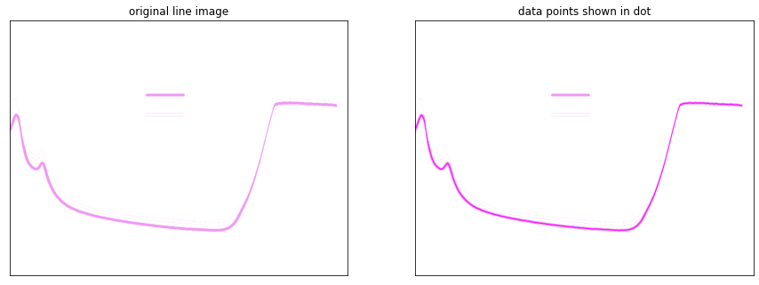
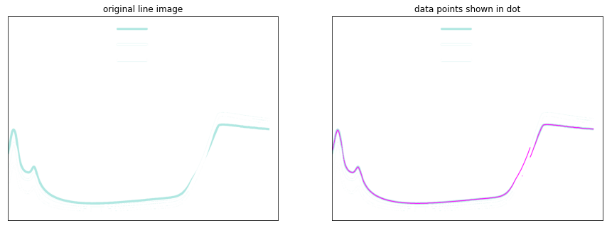

# GraphMaster

Fully automated end to end framework to extract data from complex charts and other figures in scientific literature.

Example paper used:

 *[David Payne](https://aip.scitation.org/author/Payne%2C+David)**,* *[Tsun Hang Fung](https://aip.scitation.org/author/Fung%2C+Tsun+Hang)**,* *[Muhammad Umair Khan](https://aip.scitation.org/author/Khan%2C+Muhammad+Umair)**,* *[Malcolm Abbott](https://aip.scitation.org/author/Abbott%2C+Malcolm)**. et* al. Understanding the optics of industrial black silicon. AIP Conference Proceedings 1999,05007(2018) 571, 95–98 (2019).

Example Figure:

## Figure Extraction

beautifulsoup 4 & pdffigures2 is used to extract images (charts + tables) from the scientific literature PDF. 

Some publishers will provide classified charts of each literature, like ACS.

https://github.com/allenai/pdffigures2

https://github.com/wention/BeautifulSoup4

## Axes Detection

Gives the best estimate of the x and y-axis(horizontal and vertical axes) for the plot.

Example Y-axis detection:

We detect axes based on the max-continuous black pixels.

## Text Recognition 

We used AWS-Rekognition API for text detections in the image.

Example Performance:(Confidence >=80)

| Y-Axis Texts Detection | Legends Texts Detection | X-Axis Texts Detection |
| :--------------------: | :---------------------: | :--------------------: |
|  80(Confidence:92.7)   |   R1(Confidence:83.7)   |  450(Confidence:98.7)  |
|  70(Confidence:99.6)   |   R2(Confidence:98.1)   |  250(Confidence:99.1)  |
|  60(Confidence:97.2)   |   R3(Confidence:96.3)   | 1250(Confidence:92.9)  |
|  40(Confidence:99.7)   |  ISO(Confidence:95.4)   |                        |
|           ..           |           ..            |                        |

## Colour Cluster 

The image will be separated into several figures based on the same RGB colour.

We experimented with a different threshold value and found threshold value equal to 16 fits most of the charts.

Example clustered graph

Then our model will select from these 16 charts, for example, it automatically selects 7 charts for the example graphs.

## Data Extraction

We use the pixel projection methods to calculate both the x-value and y-value of each chart, and then save it as a CSV profile. The value-tick ration is calculated by:

Example Outputs:

## Result Analysis(Optional)

We recommend using the Spearman correlation(Scipy) for comparison of the extracted data and real data. Noted that we compare with the raw data provided by the author. 

Example Results:

| Data group | Error | Correlation |
| :--------: | :---: | :---------: |
|   1(iso)   | 0.055 |   99.98%    |
|   2(M3)    | 0.025 |   99.98%    |
|   3(M2)    | 0.037 |   99.98%    |
|   4(M1)    | 0.034 |   99.98%    |
|   5(R1)    | 0.114 |   99.87%    |
|   6(R2)    | 0.056 |   99.95%    |
|   7(R3)    | 0.020 |   99.98%    |

If you used the manually extracted data, the result might be not accurate due to the human equation.

## Contact

If any problems, please send an email to:

**University of New South Wales**

Tong Xie, tong.xie@unsw.edu.au

**Melbourne University** 

Ran Liang

**University of California, Berkeley** 

Nather Hao
